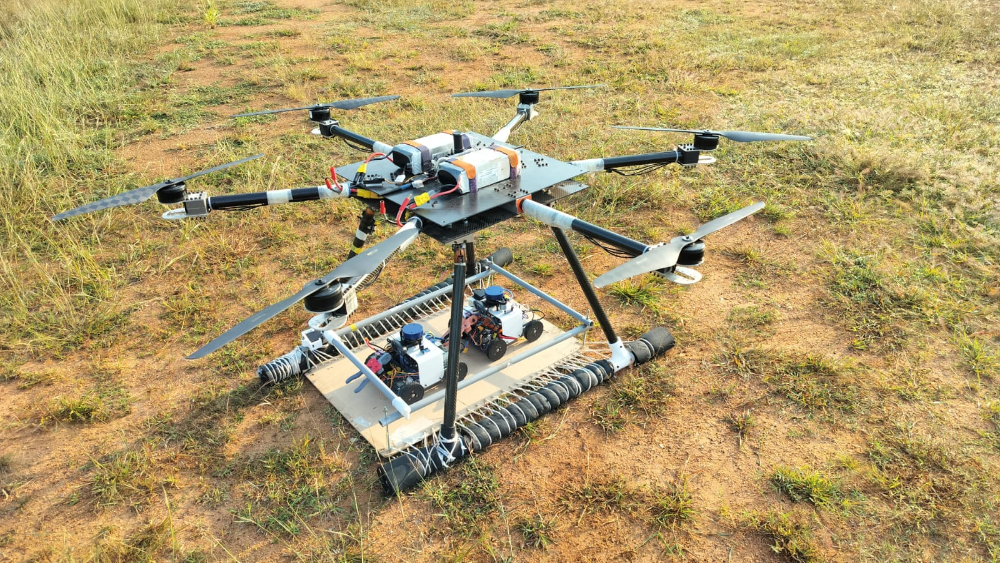
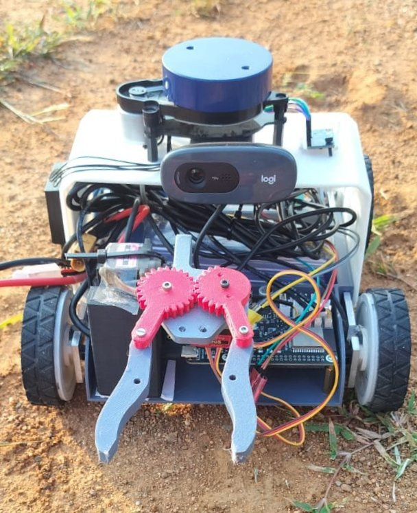

# Multi-Robot-Collab-SLAM  
**AERIS-SLAM | ROS2, SLAM-GMAPPING**  
**Aug 2025 – Present**

AERIS-SLAM is a multi-robot exploration and mapping system built using **ROS2** and **SLAM-GMapping** for 2D LiDAR-based mapping.  
The project combines a **9-DoF hexacopter** with **three autonomous differential-drive ground robots**, enabling collaborative mapping, object detection, and autonomous mission execution in outdoor, GPS-denied environments.

---

## 🚁 System Overview

### **Hexacopter Platform**
- Custom-designed **9-DoF hexacopter** with high payload capacity  
- Carries and deploys **three ground robots**  
- Ensures vibration-minimized release for safe deployment  
- Supervises mission through a high-level coordinator node  
- Assigns exploration points based on map coverage  

### **Ground Robots**

  
  

Each robot is equipped with:
- **2D LiDAR** → for SLAM-GMapping  
- **Camera** → for object detection & grasping only (not SLAM)  
- **Gripper** → for basic object interaction  
- **Differential-drive base**  
- ROS2 nodes for mapping, navigation, and task execution  

---

## 🗺️ Core Capabilities

### 🔵 **1. Multi-Robot SLAM (GMapping)**
- Each robot runs **SLAM-GMapping** independently  
- Generates a local 2D occupancy grid  
- Performs **inter-robot loop closures** based on LiDAR scan matching  
- Periodic **map merging** to form a unified global map  
- Fully distributed with ROS2 DDS

---

### 🔵 **2. UAV-Assisted Exploration**
The UAV acts as a mission supervisor:
- Monitors exploration progress of all robots  
- Identifies **unmapped regions**  
- Assigns **search points** to robots to maximize map coverage  
- Coordinates spacing to avoid overlap and clashes  

---

### 🔵 **3. Autonomous Deployment & Extraction**
- Hexacopter deploys the robots at mission start  
- Robots autonomously switch to “exploration mode”  
- After mapping, the UAV provides rendezvous coordinates  
- Robots perform **autonomous docking** for aerial extraction  

---

### 🔵 **4. Camera-Based Object Detection & Grasping**
(Not used for SLAM, only perception)
- Detects objects in the environment (e.g., markers, tools)  
- Gripper executes simple pickups or interactions  
- Integrated with LiDAR-based navigation for safe approach  

---

## 🔧 Software Stack

| Component | Technology Used |
|----------|-----------------|
| Robot OS | **ROS2** |
| SLAM | **SLAM-GMAPPING** |
| Map fusion | Custom multi-robot map merging (ROS2) |
| Communication | ROS2 DDS |
| Navigation | ROS2 Nav2 (DWB/DWA local planner) |
| UAV supervision | Custom mission control node |
| Object detection | Camera + ML model |
| Robot control | Differential-drive kinematics |

---

